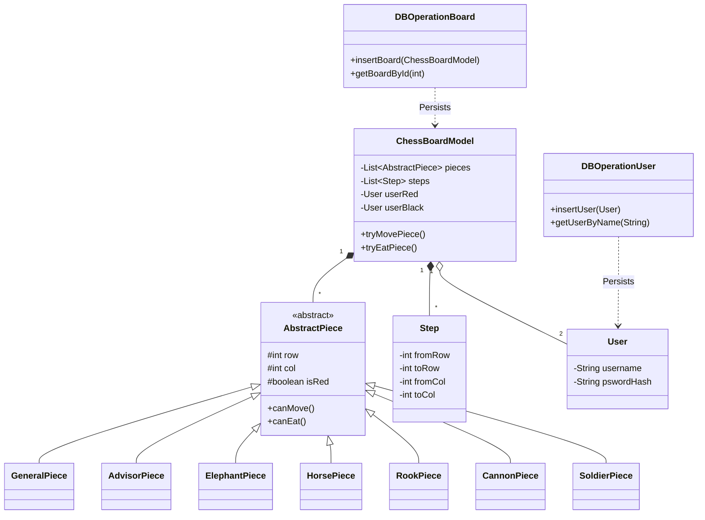

# Model Package Documentation

该文件夹包含了中国象棋项目的所有核心业务逻辑模型和数据持久化相关的类。这些类负责定义游戏规则、维护游戏状态、管理用户信息以及处理数据库操作。

## 文件结构与功能描述

### 1. 核心模型 (Core Models)

这些类定义了游戏的基本数据结构和状态管理。

*   **`ChessBoardModel.java`**
    *   **功能**: 游戏的核心模型类，维护整个棋盘的状态。
    *   **职责**:
        *   存储棋盘上的所有棋子 (`pieces`)。
        *   记录游戏历史步骤 (`steps`)。
        *   管理当前回合 (`whoseTurn`) 和游戏状态（进行中、胜负、和棋）。
        *   提供移动棋子、吃子、悔棋（复盘）等核心逻辑方法。
        *   验证移动的合法性 (`isValidPosition`, `tryMovePiece`, `tryEatPiece`)。
    *   **关系**: 聚合了 `AbstractPiece`、`Step` 和 `User`。

*   **`AbstractPiece.java`**
    *   **功能**: 所有棋子的抽象基类。
    *   **职责**:
        *   定义棋子的通用属性：类型、阵营（红/黑）、位置（行/列）、存活状态。
        *   定义抽象方法 `canMove` 和 `canEat`，由子类实现具体的移动和吃子规则。
    *   **关系**: 被具体的棋子类继承。

*   **`Coordinate.java`**
    *   **功能**: 表示棋盘上的一个坐标点 (row, col)。
    *   **职责**: 简单的不可变数据类，用于位置计算和传递。

*   **`Step.java`**
    *   **功能**: 记录游戏中的一步操作。
    *   **职责**:
        *   存储操作类型（移动/吃子）。
        *   记录移动前后的坐标 (`fromRow`, `fromCol` -> `toRow`, `toCol`)。
        *   记录被操作的棋子类型和阵营。
    *   **关系**: 用于 `ChessBoardModel` 中的历史记录和复盘功能。

*   **`User.java`**
    *   **功能**: 用户模型类。
    *   **职责**: 存储用户的 ID、用户名、密码哈希、类型（普通用户/游客/AI等）和描述信息。

### 2. 棋子实现 (Piece Implementations)

这些类继承自 `AbstractPiece`，分别实现了中国象棋中不同兵种的特定规则。

*   **`GeneralPiece.java` (帅/将)**: 只能在九宫格内移动，每次一步。
*   **`AdvisorPiece.java` (仕/士)**: 只能在九宫格内沿斜线移动，每次一步。
*   **`ElephantPiece.java` (相/象)**: 走“田”字，不能过河，有“塞象眼”规则。
*   **`HorsePiece.java` (马)**: 走“日”字，有“别马腿”规则。
*   **`RookPiece.java` (车)**: 直线行走，无距离限制。
*   **`CannonPiece.java` (炮)**: 移动如车，吃子需“隔山打牛”。
*   **`SoldierPiece.java` (兵/卒)**: 过河前只能向前，过河后可向前或左右移动，每次一步。

### 3. 数据持久化 (Data Persistence)

这些类负责与 SQLite 数据库交互，实现数据的存取。

*   **`DBOperationBoard.java`**
    *   **功能**: 棋盘（存档）数据的数据库操作类。
    *   **职责**:
        *   `createTable`: 创建 `boards` 表。
        *   `insertBoard`: 保存新的游戏存档。
        *   `deleteBoardById`: 删除存档。
        *   `updateBoard*`: 更新存档的各种属性（名称、状态、历史记录等）。
        *   `getBoard*`: 从数据库加载存档并还原为 `ChessBoardModel` 对象。
        *   辅助方法：将棋子列表和步骤列表序列化/反序列化为字符串存储。

*   **`DBOperationUser.java`**
    *   **功能**: 用户数据的数据库操作类。
    *   **职责**:
        *   `createTable`: 创建 `users` 表，并初始化默认用户（Red, Black, null）。
        *   `insertUser`: 注册新用户。
        *   `updateUser*`: 更新用户信息。
        *   `getUser*`: 查询用户。
        *   `calHash`: 计算密码的 SHA-256 哈希值。

## 类关系图

