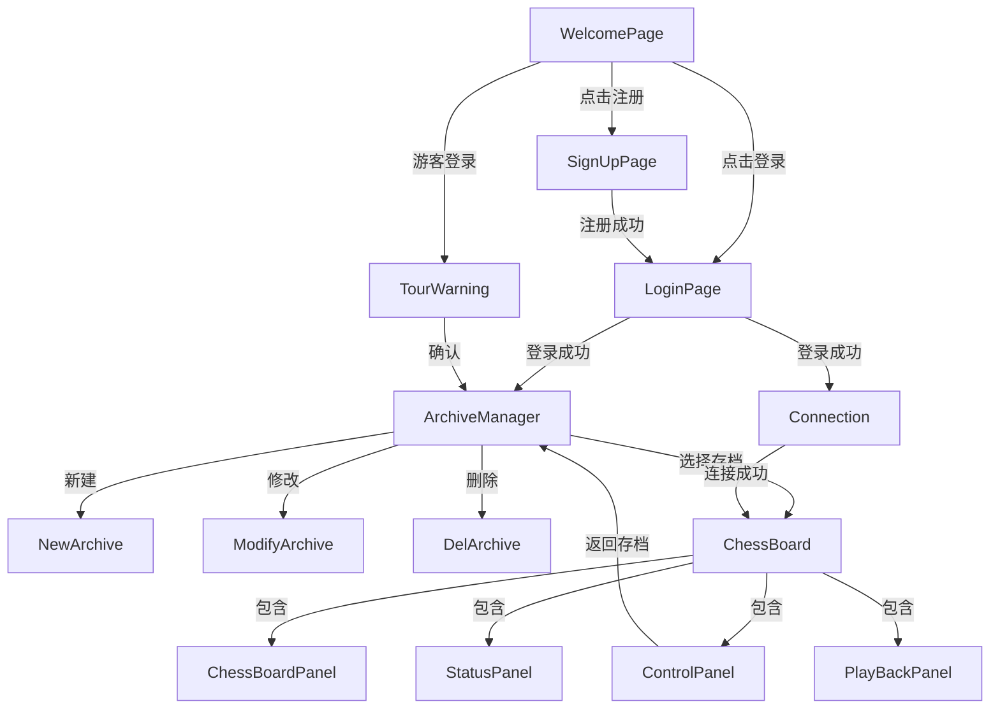

# UI Package Documentation

该文件夹包含了中国象棋项目的所有用户界面（User Interface）相关的类。这些类主要负责图形界面的展示、用户交互的处理以及与模型层（Model）的数据交换。

## 文件结构与功能描述

### 1. 核心游戏界面 (Core Game Components)

这些组件共同组成了游戏的主界面。

*   **`ChessBoard.java`**
    *   **功能**: 游戏的主窗口（JFrame）。
    *   **关系**: 作为容器，管理并组装 `ChessBoardPanel`（棋盘）、`ControlPanel`（控制栏）、`StatusPanel`（状态栏）和 `PlayBackPanel`（复盘栏）。它负责协调这些子组件之间的交互。
    *   **依赖**: `ChessBoardModel`。

*   **`ChessBoardPanel.java`**
    *   **功能**: 负责绘制棋盘网格、棋子，并处理用户的点击事件（选子、移动、吃子）。
    *   **关系**: 嵌入在 `ChessBoard` 中。它是游戏交互的核心区域。
    *   **交互**: 捕获鼠标点击，调用 `ChessBoardModel` 的逻辑方法，并触发界面重绘。在联机模式下，通过回调通知 `Connection` 发送移动指令。支持根据玩家阵营（红/黑）自动翻转棋盘视角。

*   **`ControlPanel.java`**
    *   **功能**: 位于棋盘左侧的控制面板，提供“重置”、“复盘”、“返回存档”、“投降”等功能按钮。
    *   **关系**: 嵌入在 `ChessBoard` 中。

*   **`StatusPanel.java`**
    *   **功能**: 位于棋盘顶部的状态面板，显示当前回合信息（红方/黑方回合）以及游戏胜负结果。
    *   **关系**: 嵌入在 `ChessBoard` 中。

*   **`PlayBackPanel.java`**
    *   **功能**: 位于棋盘右侧的复盘面板（默认隐藏），显示走棋历史记录列表。
    *   **关系**: 嵌入在 `ChessBoard` 中。用户可以在此查看和回溯之前的步骤。

*   **`Connection.java`**
    *   **功能**: 处理联机对战的网络连接逻辑。
    *   **实现**: 使用 UDP 协议进行局域网广播发现对手，建立连接后同步双方的走棋操作。
    *   **交互**: 独立窗口，连接成功后会创建并打开 `ChessBoard`。

### 2. 认证与菜单 (Authentication & Menu)

负责用户的登录、注册和初始引导。

*   **`WelcomePage.java`**
    *   **功能**: 程序的入口页面（欢迎页）。
    *   **交互**: 提供“登录”按钮跳转至 `LoginPage`，以及“登出”功能。初始化数据库表结构。

*   **`LoginPage.java`**
    *   **功能**: 用户登录对话框。
    *   **交互**: 验证用户名和密码。登录成功后跳转至 `ArchiveManager`。支持“仅游客登录”模式。

*   **`SignUpPage.java`**
    *   **功能**: 用户注册对话框。
    *   **交互**: 允许新用户创建账号。

*   **`LogoutPage.java`**
    *   **功能**: 登出确认对话框。

*   **`ChangePwd.java`**
    *   **功能**: 修改密码对话框。
    *   **交互**: 验证旧密码并设置新密码。支持 Enter 键快速切换焦点和提交。

*   **`TourWarning.java`**
    *   **功能**: 游客模式警告弹窗，提示用户游客模式的功能限制（如只能单机）。

### 3. 存档管理 (Archive Management)

负责游戏存档的创建、读取、修改和删除。

*   **`ArchiveManager.java`**
    *   **功能**: 存档管理主窗口，以列表形式展示当前用户的所有游戏存档。
    *   **内部类**: `ArchivePanel` (负责绘制存档列表项), `bottomPlaceHolderPanel` (底部按钮栏)。
    *   **交互**: 点击存档可进入游戏 (`ChessBoard`)。提供新建、修改、删除存档的入口。支持键盘导航（↑/↓选择，Enter进入，Esc取消选择，Delete删除）。

*   **`NewArchive.java`**
    *   **功能**: 新建存档对话框。
    *   **交互**: 设置存档名称、描述以及先手方（红/黑/随机）。

*   **`ModifyArchive.java`**
    *   **功能**: 修改存档信息对话框。
    *   **交互**: 修改已存在存档的名称和描述。

*   **`DelArchive.java`**
    *   **功能**: 删除存档确认对话框。

### 4. 自定义组件与工具 (Custom Components & Utilities)

提供统一的 UI 风格和复用组件。

*   **`Style.java`**
    *   **功能**: 定义全局静态样式常量，如默认字体、颜色、屏幕尺寸等。

*   **`BackgroundPanel.java`**
    *   **功能**: 支持背景图片绘制的通用面板，用于 `ChessBoard` 等界面的背景渲染。

*   **`JRoundButton.java`**
    *   **功能**: 自定义圆角按钮组件，统一按钮风格。

*   **`JRoundTextField.java`**
    *   **功能**: 自定义圆角文本输入框组件。

*   **`JRoundPasswordField.java`**
    *   **功能**: 自定义圆角密码输入框组件。

*   **`JRoundScrollPane.java`**
    *   **功能**: 自定义圆角滚动窗格，提供美化的滚动条样式，用于 `ArchiveManager` 的列表展示。

### 5. 交互特性 (Interaction Features)

*   **快捷键支持 (Keyboard Shortcuts)**
    *   **ArchiveManager**:
        *   `↑` / `↓`: 上下移动选中项。
        *   `Enter`: 进入选中的存档。
        *   `Esc`: 取消当前选中项。
        *   `Delete`: 删除选中的存档。
    *   **对话框 (Dialogs)**:
        *   `Enter`: 确认/提交。
        *   `Esc`: 取消/关闭。

*   **视图适配 (View Adaptation)**
    *   **棋盘翻转**: 在联机模式下，若玩家执黑方，棋盘将自动翻转 180 度，使己方棋子位于下方，符合对弈习惯。

## 界面流转关系图

